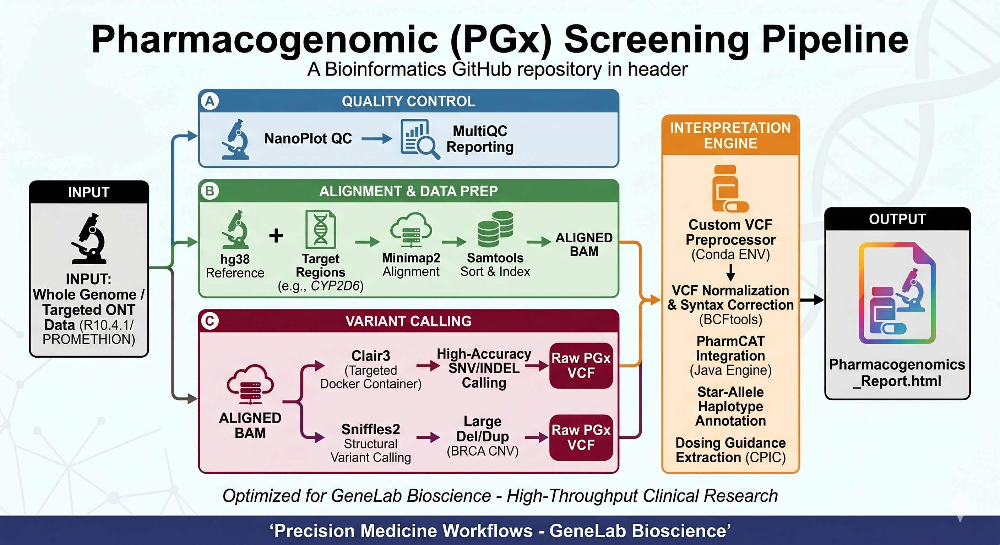

# High-Accuracy Pharmacogenomic (PGx) Pipeline
## Facility: GeneLab Bioscience | Precision Medicine Core

### 💊 Overview
This repository contains a clinical-grade, end-to-end processing pipeline designed to convert raw Oxford Nanopore Technologies (ONT) long-read sequencing data into actionable pharmacogenomic profiles. The pipeline automates the detection of genetic variants in key drug-metabolizing enzymes (e.g., *CYP2D6*, *CYP2C19*, *DPYD*) and interprets them into standard star-allele genotypes.

### 🚀 Key Pipeline Features
* **Quality Verification:** Integrated pre-alignment quality check of high-throughput ONT fastq files using `NanoPlot`.
* **Standard ONT Variant Engine:** Implements the latest `Clair3` high-accuracy model via Docker for precise SNV and Indel characterization.
* **Automated VCF Preprocessing:** Custom patches to format headers, normalize multi-allelic sites, and adjust syntax to ensure strict compatibility with the PharmCAT engine.
* **Haplotype Calling Integration:** Direct parsing through `PharmCAT` to yield automated star-allele calls and CPIC dosing guidance tables.

### 🛠️ Core Tool Stack
* **QC:** `NanoPlot`
* **Mapping:** `Minimap2` & `Samtools`
* **Variant Discovery:** `Clair3` (Dockerized)
* **PGx Interpretation:** `PharmCAT` (Java Engine)
